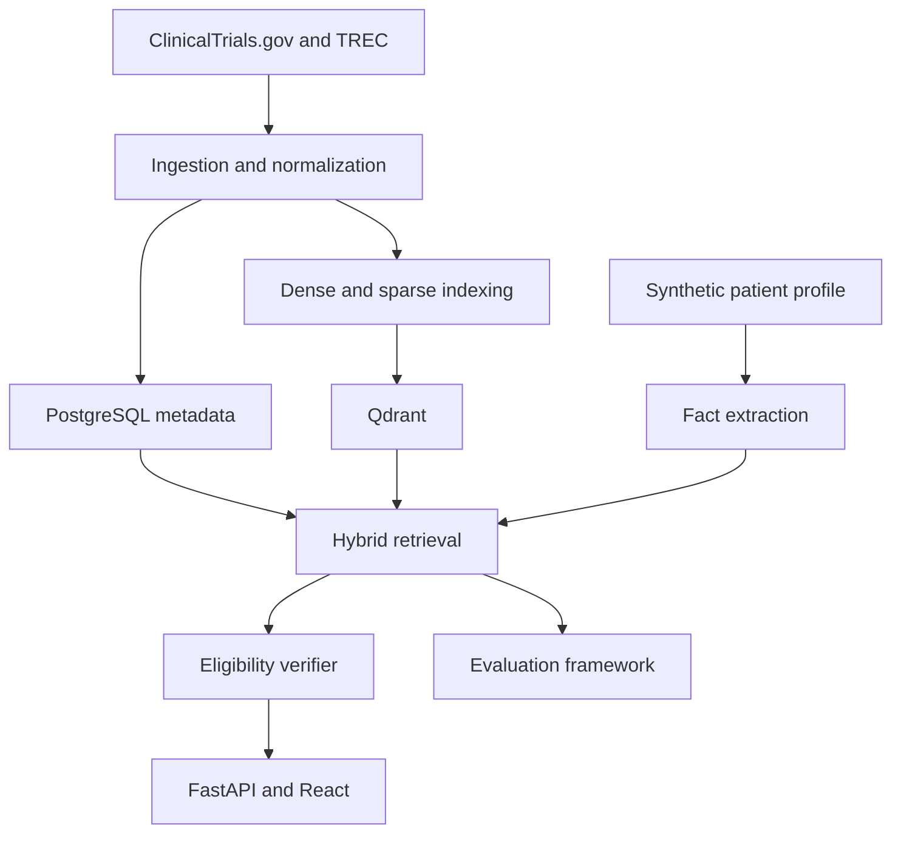

# Eligibility-Aware Clinical Trial Retrieval

**Explainable, eligibility-aware clinical-trial retrieval for synthetic patient profiles.**

This research and portfolio project retrieves clinical trials for a synthetic patient description and then distinguishes among:

- medically relevant trials for which the patient appears potentially eligible;
- medically relevant trials containing a likely exclusion;
- trials where the available patient information is insufficient; and
- trials that are not relevant.

The project combines classical information retrieval, dense embeddings, a vector database, structured filtering, reranking, criterion-level verification, and rigorous evaluation. It is deliberately not a generic “chat with medical documents” application.

> [!IMPORTANT]
> This is an educational research prototype. It must use public trial information and synthetic patient cases only. It must never claim to determine clinical eligibility, recommend treatment, diagnose a patient, or replace review by qualified professionals.

## Central research question

> Can an eligibility-aware hybrid retrieval system distinguish genuinely eligible trials from trials that are medically relevant but exclude the patient?

## Why the problem is difficult

A search system can retrieve a trial because its condition resembles the patient’s condition while overlooking that:

- the patient is outside the permitted age range;
- a previous treatment is prohibited;
- a comorbidity violates an exclusion criterion;
- a required laboratory result is missing;
- the trial is not recruiting in an appropriate location; or
- the eligibility language is ambiguous.

The system therefore separates **relevance retrieval** from **eligibility assessment**. Similarity is used to find candidates; it is not treated as proof of eligibility.

## Planned capabilities

| Capability | Purpose |
|---|---|
| BM25 retrieval | Strong exact-term and lexical baseline |
| Dense retrieval | Conceptual matching with biomedical embeddings |
| Qdrant HNSW search | Approximate nearest-neighbour retrieval at practical scale |
| Hybrid retrieval | Fuse lexical and semantic rankings |
| Metadata filtering | Apply age, sex, status, phase, country, and other structured constraints |
| Reranking | Improve precision over the initial candidate set |
| Patient fact extraction | Structure age, conditions, medications, treatments, and measurements |
| Eligibility parsing | Split inclusion and exclusion text into atomic criteria |
| Criterion verification | Label individual criteria as satisfied, violated, unknown, or not applicable |
| Evidence explanations | Link every assessment to exact source text and patient facts |
| Retrieval laboratory | Compare methods, ablations, latency, and ANN recall |

## Data sources

- **[ClinicalTrials.gov API v2](https://clinicaltrials.gov/data-api/api)** for public clinical-trial records.
- **[TREC Clinical Trials 2021/2022](https://trec.nist.gov/data/trials2022.html)** for synthetic patient topics and relevance judgments.
- **[Synthea](https://synthetichealth.github.io/synthea/)** as an optional later source of synthetic FHIR patient records.

No real patient records belong in this repository.

## Architecture



## Repository map

| Path | Responsibility |
|---|---|
| `backend/` | FastAPI application, persistence interfaces, retrieval orchestration, and screening services |
| `pipelines/` | Source connectors, normalization, criterion parsing, embedding, and indexing |
| `evaluation/` | BM25/dense baselines, TREC evaluation, ablations, significance tests, and reports |
| `frontend/` | Planned React and TypeScript interface |
| `infrastructure/` | Docker Compose, container configuration, and later monitoring |
| `data/` | Local-only raw/interim/processed data boundaries; large data are Git-ignored |
| `notebooks/` | Exploration only; production logic must live in Python modules |
| `docs/` | Architecture, data contracts, evaluation, safety, experiments, and decisions |
| `scripts/` | Reproducible command wrappers |

See [docs/architecture/README.md](docs/architecture/README.md) for component boundaries.

## Current implementation

The repository currently includes a minimal health endpoint and a bounded, reproducible source-inspection pipeline. Retrieval and eligibility features are not yet implemented.

The bounded inspection retrieved **500 public trial records**, loaded **50 synthetic TREC 2022 topics and 35,394 judgments**, produced field profiles and complete selected-ID traces, and manually inspected ten topic–trial pairs for source consistency. Raw downloads and generated reports remain local and Git-ignored.

Read the [inspection results](docs/experiments/0001-bounded-data-inspection.md) and the [reproduction guide](pipelines/README.md). The [canonical schema proposal](docs/data-model.md) now reflects observed missing fields, age units, partial dates, and multi-valued phases.

Current API records are **not** checksum-verified copies of the frozen April 2021 benchmark corpus, so no benchmark metrics or eligibility decisions are claimed.

## Local requirements

The implemented foundation requires Git and Python. The planned system may also use:

- Python 3.11+
- Docker Desktop or Docker Engine with Compose
- PostgreSQL
- Qdrant
- optional Node.js for the later frontend

No paid service or GPU is required.

## Quick start

```bash
cp .env.example .env
python -m venv .venv
```

Activate the environment, then install the foundation dependencies:

```bash
pip install -e ".[dev]"
pytest
```

Start the local databases only when working on features that use them:

```bash
docker compose -f infrastructure/compose.yaml up -d
```

Run the minimal API:

```bash
uvicorn backend.app.main:app --reload
```

Then open `http://localhost:8000/health` or the generated API documentation at `http://localhost:8000/docs`.

## Engineering principles

1. Establish BM25 before adding dense retrieval.
2. Compare exact search with approximate search before tuning HNSW.
3. Treat relevant, eligible, excluded, and unknown as different states.
4. Preserve source provenance for every transformed record and explanation.
5. Version embeddings, parsers, models, and experiments.
6. Make uncertain information visible rather than silently guessing.
7. Measure improvements using qrels, metrics, ablations, and error analysis.
8. Add scale only after correctness and reproducibility are established.

## Documentation

- [Architecture](docs/architecture/README.md)
- [Data model](docs/data-model.md)
- [Evaluation protocol](docs/evaluation.md)
- [Safety and limitations](docs/safety.md)
- [Contribution workflow](CONTRIBUTING.md)

## Licence

The code scaffold is provided under the MIT License. External datasets, model weights, and terminology resources retain their own licences and usage requirements.
