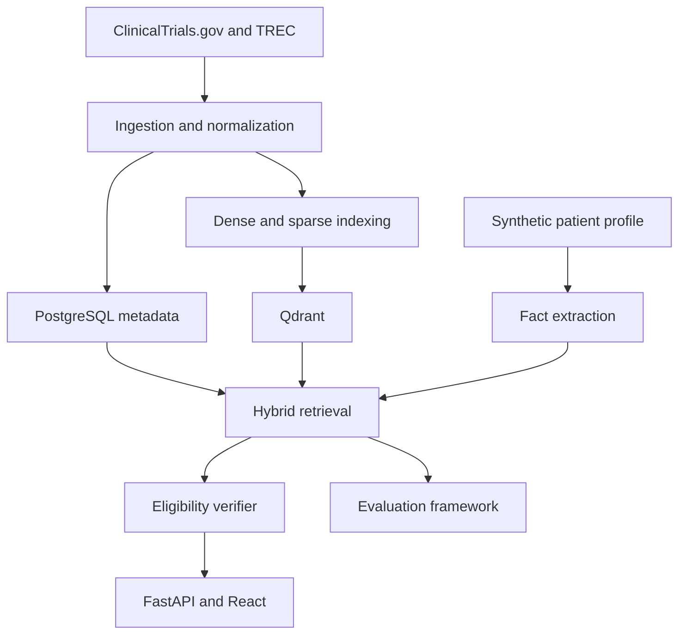

# Eligibility-Aware Clinical Trial Retrieval

**Explainable, eligibility-aware clinical-trial retrieval for synthetic patient profiles.**

This research and portfolio project retrieves clinical trials for a synthetic patient description and then distinguishes among:

- medically relevant trials for which the patient appears potentially eligible;
- medically relevant trials containing a likely exclusion;
- trials where the available patient information is insufficient; and
- trials that are not relevant.

The project combines classical information retrieval, dense embeddings, a vector database, structured filtering, reranking, criterion-level verification, and rigorous evaluation. It is deliberately not a generic “chat with medical documents” application.

> [!IMPORTANT]
> This is an educational research prototype. It must use public trial information and synthetic patient cases only. It must never claim to determine clinical eligibility, recommend treatment, diagnose a patient, or replace review by qualified professionals.

## Central research question

> Can an eligibility-aware hybrid retrieval system distinguish genuinely eligible trials from trials that are medically relevant but exclude the patient?

## Why the problem is difficult

A search system can retrieve a trial because its condition resembles the patient’s condition while overlooking that:

- the patient is outside the permitted age range;
- a previous treatment is prohibited;
- a comorbidity violates an exclusion criterion;
- a required laboratory result is missing;
- the trial is not recruiting in an appropriate location; or
- the eligibility language is ambiguous.

The system therefore separates **relevance retrieval** from **eligibility assessment**. Similarity is used to find candidates; it is not treated as proof of eligibility.

## Planned capabilities

| Capability | Purpose |
|---|---|
| BM25 retrieval | Strong exact-term and lexical baseline |
| Dense retrieval | Conceptual matching with biomedical embeddings |
| Qdrant HNSW search | Approximate nearest-neighbour retrieval at practical scale |
| Hybrid retrieval | Fuse lexical and semantic rankings |
| Metadata filtering | Apply age, sex, status, phase, country, and other structured constraints |
| Reranking | Improve precision over the initial candidate set |
| Patient fact extraction | Structure age, conditions, medications, treatments, and measurements |
| Eligibility parsing | Split inclusion and exclusion text into atomic criteria |
| Criterion verification | Label individual criteria as satisfied, violated, unknown, or not applicable |
| Evidence explanations | Link every assessment to exact source text and patient facts |
| Retrieval laboratory | Compare methods, ablations, latency, and ANN recall |

## Data sources

- **[ClinicalTrials.gov API v2](https://clinicaltrials.gov/data-api/api)** for public clinical-trial records.
- **[TREC Clinical Trials 2021/2022](https://trec.nist.gov/data/trials2022.html)** for synthetic patient topics and relevance judgments.
- **[Synthea](https://synthetichealth.github.io/synthea/)** as an optional later source of synthetic FHIR patient records.

No real patient records belong in this repository.

## Architecture



## Repository map

| Path | Responsibility |
|---|---|
| `backend/` | FastAPI application, persistence interfaces, retrieval orchestration, and screening services |
| `pipelines/` | Source connectors, normalization, criterion parsing, embedding, and indexing |
| `evaluation/` | BM25/dense baselines, TREC evaluation, ablations, significance tests, and reports |
| `frontend/` | Local React/TypeScript search, fact review and trial-source interface |
| `infrastructure/` | Docker Compose, container configuration, and later monitoring |
| `data/` | Local-only raw/interim/processed data boundaries; large data are Git-ignored |
| `notebooks/` | Exploration only; production logic must live in Python modules |
| `docs/` | Architecture, data contracts, evaluation, safety, experiments, and decisions |
| `scripts/` | Reproducible command wrappers |

See [docs/architecture/README.md](docs/architecture/README.md) for component boundaries.

## Current implementation

The [browser research workspace](docs/research-workspace.md) supports curated synthetic-case selection, read-only fact review, default retrieval and trial/criterion source inspection. Open it locally on port 5173 after starting the services. Dedicated screening evidence, retrieval laboratory and experiment-dashboard views remain subsequent work. It preserves API evidence and defaults without introducing real-patient input or clinical decisions.

The repository includes a bounded local FastAPI application with PostgreSQL evidence persistence, source inspection and historical corpus validation, a reproducible full-corpus BM25 baseline, and bounded dense/hybrid retrieval. Local Qdrant supports verified imports, exact/ANN search, measured neighbor recall and latency, and checked snapshot/restore/rebuild procedures. Full-corpus dense evaluation and clinical validation remain deferred.

The [local API guide](docs/local-research-api.md) provides startup and manual tests for 51 curated synthetic cases and 446 public/invented trials. Search, criterion screening, source lookup and saved experiments retain evidence and version identities. Defaults remain exact dense plus legacy age/sex filters; reranking is opt-in and learned screening advisories are never promoted. Results survive restarts in PostgreSQL. The initial React search/fact/source views are now available; dedicated screening, laboratory and experiment views remain future work. See the [integration report](docs/experiments/0010-local-api-and-postgres-integration.md).

The bounded inspection retrieved **500 public trial records**, loaded **50 synthetic TREC 2022 topics and 35,394 judgments**, produced field profiles and complete selected-ID traces, and manually inspected ten topic–trial pairs for source consistency. Raw downloads and generated reports remain local and Git-ignored.

Read the [inspection results](docs/experiments/0001-bounded-data-inspection.md), the [BM25 baseline report](docs/experiments/0002-bm25-baseline.md), and the [reproduction guide](pipelines/README.md). The [canonical schema proposal](docs/data-model.md) now reflects observed missing fields, age units, partial dates, and multi-valued phases.

The BM25 metrics use the separately downloaded and validated April 27, 2021 corpus. Current API records remain unsuitable for benchmark scoring. TREC grades are source relevance labels, not current medical eligibility decisions.

The [dense workflow guide](evaluation/README.md#bounded-dense-retrieval) explains model preparation, sample encoding, offline synthetic-topic search, and real-model checks. Its [reviewed smoke-test report](docs/experiments/0003-bounded-dense-smoke.md) reports operational correctness, resource measurements, and truncation limitations without claiming superiority over BM25.

The [Qdrant diagnostic](docs/experiments/0004-bounded-qdrant-ann-recovery.md) records actual HNSW graph use, exact-versus-ANN neighbor recall and latency, snapshot recovery, and artifact-only rebuilding. Higher effort recovered all exact neighbors on the small pool, but the experiment did not demonstrate a meaningful speed advantage or full-corpus retrieval quality.

The [hybrid workflow](docs/hybrid-retrieval.md) adds versioned BM25 sparse vectors, identical dense/sparse filters, and Reciprocal Rank Fusion with branch scores and evidence. Its [controlled ablation](docs/experiments/0005-bounded-hybrid-ablation.md) improves top-100 recall but reduces average top-10 quality versus dense. Exact dense with age/sex filtering remains the command-line default; hybrid is an explicit research option. The later API and initial browser workspace reuse these services without changing their diagnostic limits.

The [synthetic fact workflow](docs/patient-facts.md) extracts bounded age, sex, condition, medication, treatment, and measurement mentions with exact source spans, negation, uncertainty, history, and experiencer context. It builds auditable age/sex filter plans and exposes unsupported content. [Development evaluation](docs/experiments/0006-synthetic-patient-facts.md) checks authored examples and audits all 50 synthetic topics without claiming general clinical accuracy. Profile-based search is explicitly opt-in; previous retrieval experiments retain their original extractor.

The [eligibility parsing workflow](docs/eligibility-parsing.md) preserves trial-side source wording, sections, clause order and evidence, with bounded deterministic type/numeric rules and explicit review flags. A separate small criterion collection supports dense and sparse similarity inspection. [Development and storage checks](docs/experiments/0007-bounded-eligibility-parsing.md) report exact authored-example results and honest historical coverage limits. This adds no patient eligibility decisions and does not change retrieval defaults.

The [research screening workflow](docs/eligibility-verification.md) connects synthetic facts to complete supported criteria, preserves evidence and reports blockers, unknowns and missing information. An optional local NLI model supplies separately labelled, non-promoted advisories. [Evaluation](docs/experiments/0008-bounded-screening-and-semantic-verification.md) reports successful authored rule checks, limited historical coverage and semantic confidence failures. No confirmed eligibility, automatic semantic screening or retrieval-default change is introduced.

The [reranking and explanation workflow](docs/reranking-and-explanations.md) optionally reorders a bounded exact-dense candidate prefix with a pinned local relevance model. It preserves original rankings, exposes shortened model inputs, and links fixed explanation statements to source fields and validated screening evidence. The [quality/latency experiment](docs/experiments/0009-bounded-reranking-and-explanations.md) compares fixed depths on the existing diagnostic pool. That diagnostic introduced no default promotion or eligibility-score fusion; later API/UI work preserves those limits.

## Local requirements

The implemented foundation requires Git and Python. The planned system may also use:

- Python 3.11+
- Docker Desktop or Docker Engine with Compose
- PostgreSQL
- Qdrant
- Node.js 24.16+ and npm for the local frontend

No paid service or GPU is required.

## Quick start

```bash
cp .env.example .env
python -m venv .venv
```

Activate the environment, then install the foundation dependencies:

```bash
pip install -e ".[dev]"
pytest
```

Start the local databases only when working on features that use them:

```bash
docker compose -f infrastructure/compose.yaml up -d
```

Run the local API:

```bash
uvicorn backend.app.main:app --host 127.0.0.1 --no-access-log
```

Then open `http://localhost:8000/health` or the generated API documentation at `http://localhost:8000/docs`.

## Engineering principles

1. Establish BM25 before adding dense retrieval.
2. Compare exact search with approximate search before tuning HNSW.
3. Treat relevant, eligible, excluded, and unknown as different states.
4. Preserve source provenance for every transformed record and explanation.
5. Version embeddings, parsers, models, and experiments.
6. Make uncertain information visible rather than silently guessing.
7. Measure improvements using qrels, metrics, ablations, and error analysis.
8. Add scale only after correctness and reproducibility are established.

## Documentation

- [Architecture](docs/architecture/README.md)
- [Data model](docs/data-model.md)
- [Evaluation protocol](docs/evaluation.md)
- [Safety and limitations](docs/safety.md)
- [Local vector storage and exact-search checks](docs/local-vector-storage.md)
- [Contribution workflow](CONTRIBUTING.md)

## Licence

The code scaffold is provided under the MIT License. External datasets, model weights, and terminology resources retain their own licences and usage requirements.
