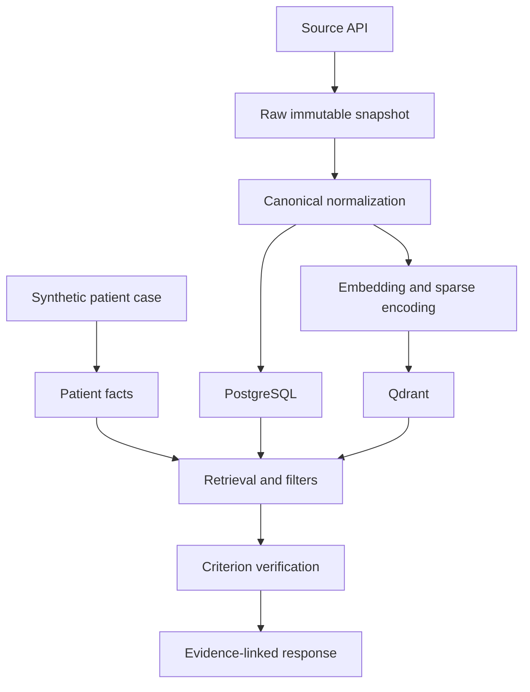

# Architecture

The project uses clear boundaries so retrieval, eligibility analysis, and application concerns can evolve independently.

## Components

### Source connectors

Retrieve public records without assigning project meaning to source-specific JSON. Connectors own pagination, retries, raw snapshots, and source identifiers.

### Normalization pipeline

Maps source records into canonical trial, condition, intervention, location, and eligibility structures. It owns validation and content hashing but not vector generation.

### PostgreSQL

Acts as the authoritative store for normalized records, ingestion state, model versions, experiment manifests, and criterion assessments.

### Qdrant

Acts as the retrieval index. It stores versioned dense/sparse representations plus filterable payloads. It is not the sole source of truth for trial records.

### Retrieval service

Executes lexical, dense, hybrid, filtered, and reranked retrieval. It must retain branch ranks and scores for audit and evaluation.

### Patient extraction

Converts synthetic narrative into structured facts with source spans, negation, temporality, and certainty.

### Eligibility service

Compares patient facts with atomic trial criteria. Reliable structured constraints use deterministic rules; ambiguous semantic constraints may use learned models. Unknown remains a valid outcome.

### Explanation service

Builds evidence-linked output from stored facts, criteria, filters, and scores. It must not invent rationales.

### Evaluation framework

Runs systems from immutable experiment configurations and produces retrieval, eligibility, ANN, latency, significance, ablation, and error-analysis outputs.

### API and frontend

Expose stable application contracts and make uncertainty, evidence, and provenance visible.

## Data flow

## Primary collection plan

### `trials_v1`

- one point per trial;
- `overview_dense` named dense vector;
- `lexical_sparse` named sparse vector;
- payload for status, phase, sex, age bounds, countries, conditions, and parser availability.

### `criteria_v1`

- one point per atomic criterion;
- `criterion_dense` and `criterion_sparse` representations;
- payload for trial ID, section, criterion type, and parser version.

The implemented bounded `criteria_v1` diagnostic now stores one point per parsed criterion/group, with full evidence, parent context, source/field hashes, ordinal and parser identity. Some compound clauses intentionally remain unsplit and flagged. The separate collection is capped at 512 points and does not change trial retrieval or perform patient screening. See [ADR 0009](decisions/0009-lossless-bounded-eligibility-parsing.md).

The current diagnostic implements only age/sex payload filtering. Its dense-only collection remains `trials_v1`; the hybrid trial vectors live in the separate `trials_hybrid_v1` collection to preserve the verified dense index and its recovery artifacts. This deliberate bounded implementation is described in [ADR 0007](decisions/0007-versioned-sparse-retrieval-and-rank-fusion.md); the broader fields above remain a plan.

## Architectural decisions

[ADR 0016](decisions/0016-themis-presentation-and-source-highlights.md) records the
Themis Trial name, preference-only dark mode, academic About page and literal source-topic
title highlights. Accessible result previews preserve the recorded score scales and do
not introduce percentage-match claims or new inference.

[ADR 0015](decisions/0015-reproducible-local-research-release.md) separates the full frozen
offline benchmark, bounded app and incremental current-registry lineage. It records
resumable shard integrity, fixed comparison inputs, release identity, clean-environment
checks and migration/recovery boundaries without changing retrieval defaults.

The local React workspace reuses the API through a fixed loopback proxy, validates displayed evidence and discards stale responses across selection changes. [ADR 0013](decisions/0013-local-react-workspace-and-staged-evidence-views.md) records the initial search/fact/source views. [ADR 0014](decisions/0014-evidence-comparisons-and-saved-experiments.md) extends that foundation with complete criterion-to-fact evidence, explicit sequential retrieval comparisons and immutable experiment review; it preserves score meanings, provenance checks and unearned promotion gates.

The bounded `/v1` API now composes the established retrieval, fact extraction, parsing, screening and explanation services. PostgreSQL stores immutable source catalogs and complete operations; Qdrant remains the rebuildable vector boundary. [ADR 0012](decisions/0012-local-research-api-and-immutable-postgres-evidence.md) records explicit migrations/imports, replay identities, structured failures, local-only constraints and isolated real-database tests. Broader normalized persistence remains future work.

Bounded cross-encoder reranking preserves candidate membership and original scores; deterministic explanations retain field-level source text and whole-criterion screening context. [ADR 0011](decisions/0011-bounded-reranking-and-evidence-explanations.md) records the fixed quality/latency protocol and why relevance scores never become eligibility probabilities or change defaults through this diagnostic.

Bounded research screening now connects synthetic profiles and parsed criteria through the existing service boundaries, without changing retrieval. Deterministic full-clause checks and optional local NLI advisories remain separate; learned proposals cannot change the screening status. [ADR 0010](decisions/0010-evidence-backed-screening-and-nli-advisories.md) records abstention, source revalidation, calibration and the unmet semantic promotion requirement.

Create a numbered Architecture Decision Record in `decisions/` for choices that materially affect reproducibility, dependencies, scale, or safety. Copy `0000-template.md` and preserve earlier decisions rather than rewriting history.
