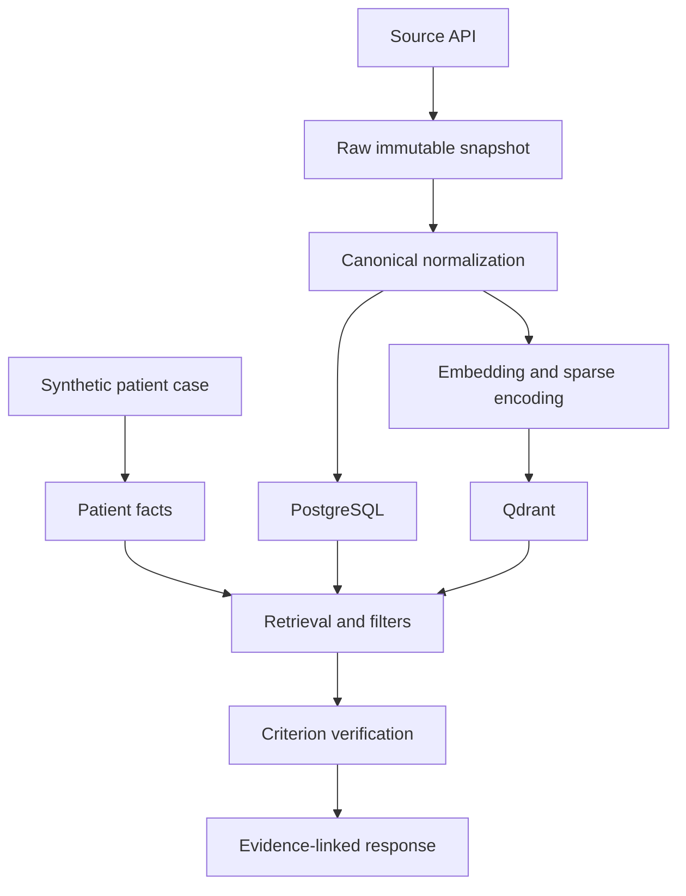

# Architecture

The project uses clear boundaries so retrieval, eligibility analysis, and application concerns can evolve independently.

## Components

### Source connectors

Retrieve public records without assigning project meaning to source-specific JSON. Connectors own pagination, retries, raw snapshots, and source identifiers.

### Normalization pipeline

Maps source records into canonical trial, condition, intervention, location, and eligibility structures. It owns validation and content hashing but not vector generation.

### PostgreSQL

Acts as the authoritative store for normalized records, ingestion state, model versions, experiment manifests, and criterion assessments.

### Qdrant

Acts as the retrieval index. It stores versioned dense/sparse representations plus filterable payloads. It is not the sole source of truth for trial records.

### Retrieval service

Executes lexical, dense, hybrid, filtered, and reranked retrieval. It must retain branch ranks and scores for audit and evaluation.

### Patient extraction

Converts synthetic narrative into structured facts with source spans, negation, temporality, and certainty.

### Eligibility service

Compares patient facts with atomic trial criteria. Reliable structured constraints use deterministic rules; ambiguous semantic constraints may use learned models. Unknown remains a valid outcome.

### Explanation service

Builds evidence-linked output from stored facts, criteria, filters, and scores. It must not invent rationales.

### Evaluation framework

Runs systems from immutable experiment configurations and produces retrieval, eligibility, ANN, latency, significance, ablation, and error-analysis outputs.

### API and frontend

Expose stable application contracts and make uncertainty, evidence, and provenance visible.

## Data flow

## Primary collection plan

### `trials_v1`

- one point per trial;
- `overview_dense` named dense vector;
- `lexical_sparse` named sparse vector;
- payload for status, phase, sex, age bounds, countries, conditions, and parser availability.

### `criteria_v1`

- one point per atomic criterion;
- `criterion_dense` and `criterion_sparse` representations;
- payload for trial ID, section, criterion type, and parser version.

The criteria collection is introduced only after the trial-level system is evaluated.

## Architectural decisions

Create a numbered Architecture Decision Record in `decisions/` for choices that materially affect reproducibility, dependencies, scale, or safety. Copy `0000-template.md` and preserve earlier decisions rather than rewriting history.
