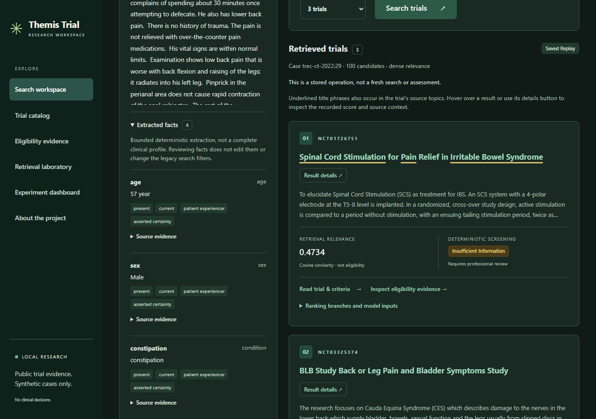
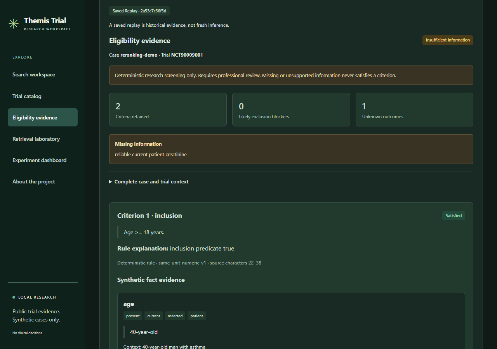
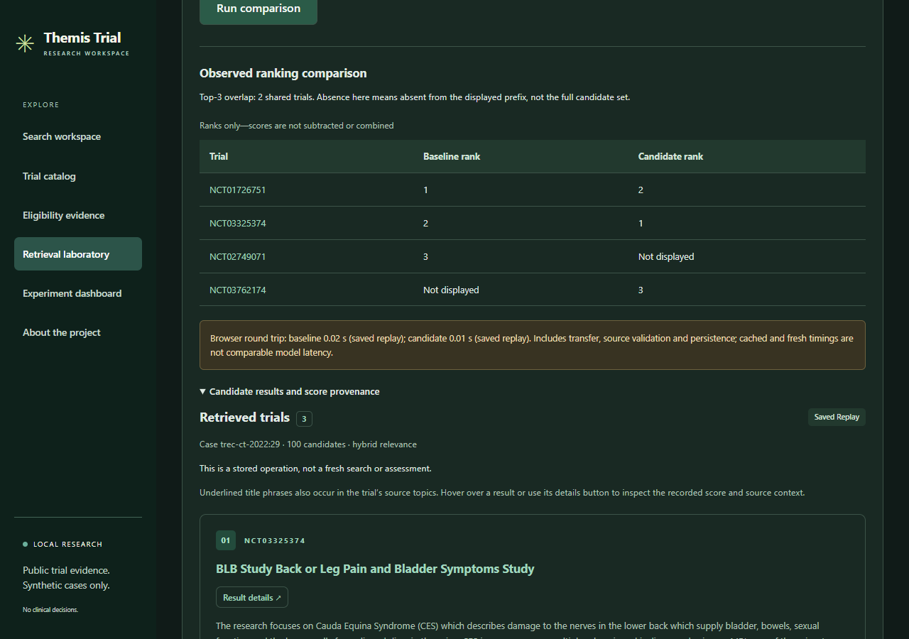
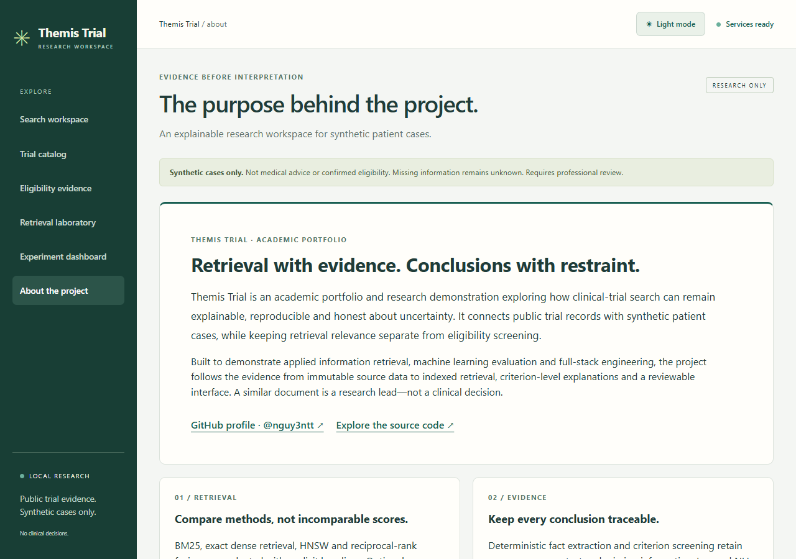

# Themis Trial — project showcase

**Retrieval with evidence. Conclusions with restraint.**

Themis Trial is an academic portfolio and research prototype exploring a difficult
search problem: a clinical trial can be relevant to a case while its criteria exclude
that case—or leave too much unknown to assess it. The project connects public trial
records with synthetic patient cases, preserves the evidence behind each step and
separates retrieval relevance from deterministic screening and learned advisories.

Built by [@nguy3ntt](https://github.com/nguy3ntt).
[Explore the source](https://github.com/nguy3ntt/eligibility-aware-clinical-trial-retrieval).
For academic assessment, portfolio review and technical demonstration only. No real
patient records, clinical eligibility decisions or treatment recommendations.

## Watch and explore

[Download the recorded walkthrough (WebM)](assets/showcase/themis-trial-demo.webm).
Open the downloaded file in a browser or a compatible video player. This is a silent,
scripted recording of the actual local application, not a hosted demo. Read the scene
guide below alongside it. Screenshots and video were captured on 2026-09-13.

| Scene, in order | What to look for | What it demonstrates |
|---|---|---|
| Search workspace | Synthetic TREC case 29, ranked public trials, raw similarity scores | Exact dense retrieval with unchanged age/sex defaults; similarity is not an eligibility probability |
| Original trial source | NCT01726751 source dialog | The underlying trial text remains available for inspection |
| Eligibility evidence | Invented `reranking-demo` case and NCT90009001; insufficient information | Missing evidence stays unknown; optional NLI is separately labelled NOT PROMOTED |
| Retrieval laboratory | Baseline/candidate ranks and overlap | Methods are compared without adding incompatible score scales |
| Experiment dashboard | 34/34 authored pairs, 41 criteria | Regression evidence on deliberately authored fixtures, not clinical accuracy |
| About and themes | Academic purpose, GitHub links, dark/light switch | A consistent research interface with explicit limits |

Some operations reopen existing immutable evidence and display **Saved Replay**.
Replay is historical, not fresh inference; recorded response times are not model benchmarks.
The video does not exercise a 375,580-trial interactive service: that corpus belongs to
the separate offline evaluation. The interactive search index contains 443 trials.

### Search with inspectable evidence

Titles underline literal overlaps with the trial's own condition/intervention fields.
Those cues are not patient matches or model attribution. Use **Result details** in the
live app to inspect the raw score, rank and source topics; no match percentage is invented.

### Screening that preserves uncertainty

Criterion outcomes retain source context, supporting facts and blockers. Learned NLI
suggestions never become medical eligibility decisions.

### Compare rankings, not incompatible scores

The laboratory preserves original ranks and separate cosine, BM25, RRF and learned
score scales. Displayed top-three overlap is not recall.

### A research interface in two themes

Only the theme preference is saved in the browser; case and result evidence is not.

## Engineering worth discussing

| Area | Implementation | Evidence to inspect |
|---|---|---|
| Retrieval algorithms | BM25 baseline, normalized MiniLM vectors, exact dot products, HNSW checked against exact neighbors, reciprocal-rank fusion and optional cross-encoder reranking | [Retrieval experiments](experiments/0011-full-corpus-release-and-hardening.md), [vector checks](local-vector-storage.md) |
| Explainability | Structured synthetic-case facts, criterion parsing, deterministic screening with source spans and explicit unknowns; learned NLI kept separate | [Workspace guide](research-workspace.md), [architecture decisions](architecture/decisions/) |
| Data engineering | Immutable source snapshots, stable identifiers, validated resumable ingestion, versioned models/indexes and verified recovery | [Reproduction and recovery](research-release.md), [pipelines](../pipelines/README.md) |
| Full-stack delivery | Validated FastAPI contracts, PostgreSQL evidence persistence, Qdrant retrieval and a React/TypeScript review workspace | [API guide](local-research-api.md), [frontend](../frontend/README.md) |
| Evaluation discipline | Frozen protocols, ranked evidence, exploratory paired intervals, negative results and independent reproduction checks | [Release report](experiments/0011-full-corpus-release-and-hardening.md) |

## Measured results—and their limits

The frozen offline experiment covers **375,580 public trials, 50 previously inspected
synthetic topics and 35,394 judgments**. These are research relevance metrics, not
clinical screening accuracy. All configurations below use the legacy age/sex filter.

| Configuration | nDCG@10 |
|---|---:|
| Matched title/condition BM25 | 0.2156 |
| Exact dense MiniLM | 0.3471 |
| RRF hybrid | 0.3487 |
| Hybrid + rerank top 10 | 0.3446 |
| Hybrid + rerank top 20 | 0.3689 |

The hybrid and rerank-20 exploratory intervals versus dense both include zero.
Reranking also receives additional summary text, so this is not a model-only comparison.
An earlier eligibility-text BM25 baseline scored 0.3761 with different inputs. There is
no claim of universal superiority or earned promotion; ordinary search stays exact dense
with age/sex filtering and no reranking. All **150 original-XML screening explanations
remain insufficient information**. The topics are not held out and clinical validation
has not been performed. See the [full report](experiments/0011-full-corpus-release-and-hardening.md).

## A concise introduction for a portfolio or interview

> I built Themis Trial, an explainable clinical-trial retrieval research system using
> public records and synthetic patient cases. It combines lexical and semantic search,
> evidence-backed criterion screening and a full-stack review interface. I evaluated
> fixed retrieval configurations across 375,580 trials, preserved negative findings and
> uncertainty, and implemented reproducible data pipelines and durable evidence replay.
> The project demonstrates how I connect ML experimentation with reliable software
> engineering without presenting research outputs as clinical decisions.

## Try it yourself

Follow the [workspace startup guide](research-workspace.md) for the prepared local
environment, or the [release guide](research-release.md) to prepare a new environment.
This is not a one-click cloud deployment; databases, models and curated artifacts are required.

1. Open the local workspace at `http://127.0.0.1:5173`. Confirm **Services ready**.
2. Select `trec-ct-2022:29`, search, and inspect NCT01726751. Open **Result details**
   and the trial title. Expect raw scores and original source text, not a match percentage.
3. Select `reranking-demo`, open **Eligibility evidence**, choose NCT90009001 and
   screen it. Expect **insufficient information**. If enabling NLI, it must remain
   separately labelled **NOT PROMOTED**.
4. In **Retrieval laboratory**, select case 29 and run the default comparison.
   Inspect original ranks and separate score provenance; normal search defaults stay unchanged.
5. In **Experiment dashboard**, run the authored screening evaluation. Expect
   **34/34 exact pairs; 41 criteria**, explicitly limited to authored fixtures.
6. Open **About the project**, check the GitHub links, switch themes and reload.
   Confirm the chosen theme persists. Do not enter or upload real patient information.

## Publication boundary

The curated media in [assets/showcase](assets/showcase/README.md) is intentionally
publishable alongside this page and the README. Raw recordings/reports, source data,
models, credentials and private milestone tracking remain ignored. No public deployment,
commit or push is part of this presentation addition. Hosted CI still needs verification
after the repository owner's manual push.
